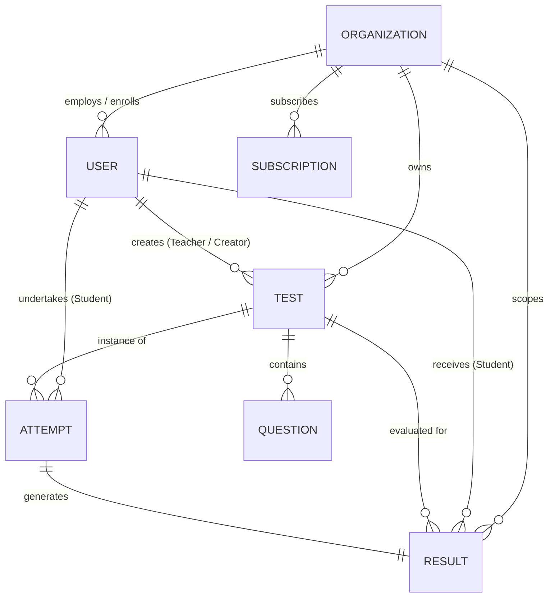

# Database Schema & Entity Relationship Architecture

This document describes the **MongoDB** schema architecture, collections, relationships, indices, and constraints powering the Multi-Tenant MCQ Examination Portal.

---

## Entity Relationship Overview

---

## 1. Organization Collection (`organizations`)

Represents an institutional tenant (school, university, coaching institute, or enterprise).

| Field | Type | Required | Default | Description |
| :--- | :--- | :--- | :--- | :--- |
| `_id` | ObjectId | Yes | Auto | Primary identifier |
| `name` | String | Yes | — | Institution legal or display name |
| `slug` | String | Yes | — | Unique, URL-friendly subdomain identifier (e.g. `oxford`) |
| `email` | String | Yes | — | Tenant administrative contact email |
| `phone` | String | No | `""` | Contact phone number |
| `address` | String | No | `""` | Institutional physical address |
| `logo` | String | No | `""` | URL to institutional branding logo |
| `status` | String | No | `"active"` | Enum: `["active", "inactive", "suspended"]` |
| `isActive` | Boolean | No | `true` | Boolean flag for fast tenant access checks |
| `subscriptionPlan` | String | No | `"free"` | Current tier: `["free", "basic", "pro", "enterprise"]` |
| `subscriptionStatus`| String | No | `"active"` | Tier billing state |
| `createdAt` | Date | No | `Date.now` | Audit timestamp |
| `updatedAt` | Date | No | `Date.now` | Audit timestamp |

**Indexes:**
- `slug` (Unique, 1)
- `email` (1)
- `status` (1)

---

## 2. User Collection (`users`)

Stores user credentials, role assignments, and tenant associations.

| Field | Type | Required | Default | Description |
| :--- | :--- | :--- | :--- | :--- |
| `_id` | ObjectId | Yes | Auto | Primary identifier |
| `name` | String | Yes | — | Full name |
| `email` | String | Yes | — | User email address (unique in system) |
| `role` | String | Yes | `"student"` | Enum: `["super_admin", "admin", "org_admin", "teacher", "student"]` |
| `phone` | String | No | `""` | Contact phone |
| `isActive` | Boolean | No | `true` | Account active flag |
| `avatar` | String | No | `""` | Profile photo URL |
| `createdAt` | Date | No | `Date.now` | Audit timestamp |

**Indexes:**
- `email` (Unique, 1)
- `{ organizationId: 1, role: 1 }` (Compound index for lightning-fast student/teacher lookups per tenant)

---

## 3. Test Collection (`tests`)

Stores exam configurations, timing limits, and visibility rules.

| Field | Type | Required | Default | Description |
| :--- | :--- | :--- | :--- | :--- |
| `_id` | ObjectId | Yes | Auto | Primary identifier |
| `title` | String | Yes | — | Test title |
| `subject` | String | No | `""` | Academic subject or domain |
| `organizationId` | ObjectId | Conditional| `null` | Reference to `organizations` |
| `createdBy` | ObjectId | Yes | — | Reference to `users` |
| `duration` | Number | Yes | `30` | Exam timer duration in minutes |
| `totalMarks` | Number | Yes | `100` | Sum total of exam points |
| `passingMarks` | Number | No | `40` | Minimum score required to pass |
| `passingPercentage`| Number | No | `40` | Passing cutoff percentage |
| `numberOfAttempts`| Number | No | `1` | Maximum attempts allowed per student |
| `type` | String | No | `"private"` | Enum: `["private", "public"]` |
| `instructions` | String | No | `""` | Pre-test guidelines shown to candidates |
| `status` | String | No | `"draft"` | Enum: `["draft", "published", "archived"]` |
| `questions` | [ObjectId] | No | `[]` | Array of references to `questions` |
| `createdAt` | Date | No | `Date.now` | Audit timestamp |

**Indexes:**
- `{ organizationId: 1, status: 1 }` (Compound index for student available test queries)
- `{ type: 1, status: 1 }` (Index for public test portal)
- `createdBy` (1)

---

## 4. Question Collection (`questions`)

Stores multiple-choice questions with answer choices, marking scheme, and explanations.

| Field | Type | Required | Default | Description |
| :--- | :--- | :--- | :--- | :--- |
| `_id` | ObjectId | Yes | Auto | Primary identifier |
| `testId` | ObjectId | Yes | — | Reference to parent `tests` document |
| `organizationId` | ObjectId | Conditional| `null` | Tenant isolation reference |
| `questionText` | String | Yes | — | Question prompt text |
| `options` | Array | Yes | — | 4 option objects: `[{ key: "A", text: "..." }]` |
| `correctAnswer` | String | Yes | — | Ground truth choice key (e.g. `"B"`) |
| `marks` | Number | No | `1` | Marks awarded for correct selection |
| `negativeMarks` | Number | No | `0` | Marks deducted for incorrect choice |
| `explanation` | String | No | `""` | Solution reasoning displayed post-exam |
| `createdAt` | Date | No | `Date.now` | Audit timestamp |

**Indexes:**
- `{ testId: 1 }` (Index for question fetching)
- `{ organizationId: 1 }` (Tenant filtering index)

---

## 5. Attempt Collection (`attempts`)

Tracks live, in-progress, or submitted candidate attempts.

| Field | Type | Required | Default | Description |
| :--- | :--- | :--- | :--- | :--- |
| `_id` | ObjectId | Yes | Auto | Primary identifier |
| `testId` | ObjectId | Yes | — | Reference to `tests` |
| `studentId` | ObjectId | Yes | — | Reference to `users` |
| `organizationId` | ObjectId | Yes | — | Reference to `organizations` |
| `attemptNumber` | Number | No | `1` | Sequential attempt index for student |
| `status` | String | No | `"started"` | Enum: `["started", "in_progress", "submitted", "evaluated"]` |
| `answers` | Array | No | `[]` | Selected answers: `[{ questionId, selectedAnswer }]` |
| `startTime` | Date | No | `Date.now` | Timestamp when student initiated test |
| `endTime` | Date | No | `null` | Timestamp when student submitted or timer expired |
| `timeTaken` | Number | No | `0` | Duration in seconds |
| `createdAt` | Date | No | `Date.now` | Audit timestamp |

**Indexes:**
- `{ studentId: 1, testId: 1 }` (Compound index for attempt count validation)
- `{ organizationId: 1, status: 1 }` (Telemetry lookups)

---

## 6. Result Collection (`results`)

Stores final evaluated scorecards with question-level breakdown and grading telemetry.

| Field | Type | Required | Default | Description |
| :--- | :--- | :--- | :--- | :--- |
| `_id` | ObjectId | Yes | Auto | Primary identifier |
| `attemptId` | ObjectId | Yes | — | Reference to `attempts` (Unique 1:1) |
| `testId` | ObjectId | Yes | — | Reference to `tests` |
| `studentId` | ObjectId | Yes | — | Reference to `users` |
| `organizationId` | ObjectId | Yes | — | Reference to `organizations` |
| `totalQuestions` | Number | Yes | — | Total questions in test |
| `attempted` | Number | No | `0` | Questions answered by student |
| `correct` | Number | No | `0` | Questions answered correctly |
| `wrong` | Number | No | `0` | Questions answered incorrectly |
| `unanswered` | Number | No | `0` | Questions left blank |
| `score` | Number | Yes | `0` | Net marks obtained (positive minus negative) |
| `totalMarks` | Number | Yes | `100` | Maximum marks attainable |
| `percentage` | Number | Yes | `0` | Final score percentage `(score / totalMarks) * 100` |
| `passed` | Boolean | Yes | `false` | Did score satisfy `passingMarks` |
| `result` | String | No | `"fail"` | `"pass"` or `"fail"` |
| `breakdown` | Array | No | `[]` | Detailed array of question responses |
| `createdAt` | Date | No | `Date.now` | Evaluation timestamp |

**Indexes:**
- `attemptId` (Unique, 1)
- `{ studentId: 1, createdAt: -1 }` (Student result history)
- `{ testId: 1, score: -1 }` (Rankings & leaderboard)
- `{ organizationId: 1, createdAt: -1 }` (Tenant reports)

---

## 7. Subscription Collection (`subscriptions`)

Tracks tenant SaaS plans, monthly billing limits, and active features.

| Field | Type | Required | Default | Description |
| :--- | :--- | :--- | :--- | :--- |
| `_id` | ObjectId | Yes | Auto | Primary identifier |
| `organizationId` | ObjectId | Yes | — | Reference to `organizations` (Unique 1:1) |
| `plan` | String | Yes | `"free"` | Enum: `["free", "basic", "pro", "enterprise"]` |
| `status` | String | No | `"active"` | Enum: `["active", "expired", "cancelled"]` |
| `maxTests` | Number | No | `5` | Test creation ceiling |
| `maxStudents` | Number | No | `100` | Enrolled student ceiling |
| `price` | Number | No | `0` | Monthly price in USD |
| `features` | [String] | No | `[]` | List of feature flags |
| `startDate` | Date | No | `Date.now` | Tier activation date |
| `endDate` | Date | No | `null` | Renewal or expiration timestamp |

**Indexes:**
- `organizationId` (Unique, 1)
- `{ plan: 1, status: 1 }` (Platform revenue aggregations)
