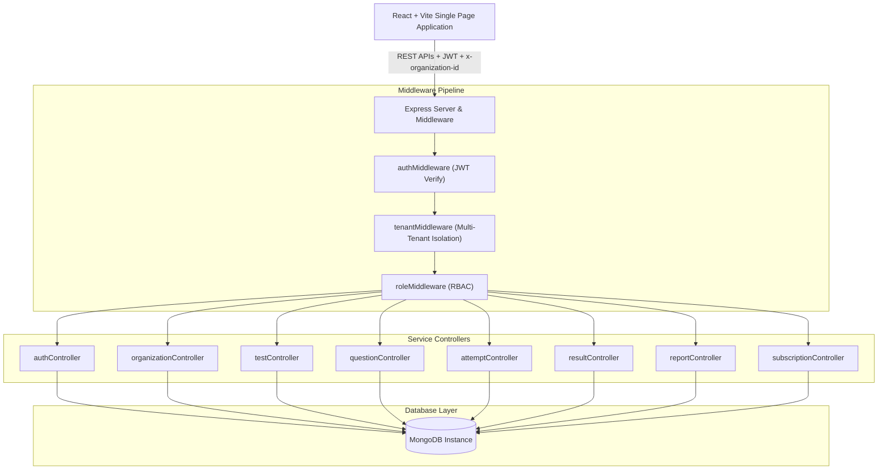

# Enterprise Multi-Tenant MCQ Assessment & Examination Portal

A full-stack, enterprise-ready, multi-tenant SaaS examination platform built on the **MERN** stack (Node.js, Express, React, Vite, MongoDB). The platform empowers educational institutions, universities, and corporate training departments to author, manage, deliver, and auto-evaluate timed multiple-choice assessments with strict tenant isolation, role-based access control, detailed telemetry reports, and tiered subscriptions.

---

## Table of Contents
1. [Architecture Overview](#architecture-overview)
2. [Multi-Tenancy & Security Model](#multi-tenancy--security-model)
3. [User Roles & Permissions](#user-roles--permissions)
4. [Key Features](#key-features)
5. [Tech Stack](#tech-stack)
6. [Project Structure](#project-structure)
7. [Environment Variables](#environment-variables)
8. [Getting Started & Local Development](#getting-started--local-development)
9. [Documentation Directory](#documentation-directory)

---

## Architecture Overview



The system employs a **shared database, isolated collection filtering** multi-tenancy model:
- Every tenant resource (`User`, `Test`, `Question`, `Attempt`, `Result`, `Subscription`) is explicitly tagged with `organizationId`.
- The `tenantMiddleware` inspects incoming authentication tokens and headers (`x-organization-id` or route parameters) to restrict database queries exclusively to the requesting tenant's namespace.
- Super Admins can bypass tenant filters to perform global oversight, create new organizations, and monitor cross-tenant revenue.

---

## Multi-Tenancy & Security Model

1. **Tenant Context Resolution**:
   - For authenticated requests, `tenantMiddleware` retrieves the user's `organizationId` from their signed JWT payload.
   - For cross-tenant Super Admin operations, queries accept an optional `organizationId` parameter or `x-organization-id` header.
2. **Preventing Question Leaks**:
   - When students take an active test, questions are served via `/api/questions/test/:testId/student`. This specialized endpoint automatically strips `correctAnswer` and explanations from the response payload, preventing devtools inspect tampering.
3. **Automated Server-Side Evaluation Engine**:
   - When an attempt is submitted (or auto-submitted by the client timer), the backend evaluation engine (`backend/utils/calculateResult.js`) compares chosen options against ground-truth question documents, tabulates correct/wrong/unanswered tallies, incorporates negative marking, and writes immutable `Result` records.

---

## User Roles & Permissions

| Role | Scope | Key Capabilities |
| :--- | :--- | :--- |
| **Super Admin** (`super_admin`) | Global Platform | Provision & manage organizations, review cross-institution teacher applications, platform telemetry, real subscription metrics. |
| **Admin / Org Admin** (`admin`, `org_admin`) | Tenant-Specific | Review & approve faculty applications, manage teachers and students, configure tests, inspect results, manage institutional tier. |
| **Teacher** (`teacher`) | Tenant-Specific | Author exams with scheduling & pass thresholds, curate question banks, review student results, subject competency tracking. |
| **Student** (`student`) | Tenant/Assigned | Direct student onboarding, browse scheduled/active assessments, full-screen timed examination, certified scorecards and history. |

---

## Key Features

- **Immersive Exam Engine (`TakeTest.jsx`)**:
  - Fullscreen distraction-minimized exam room.
  - Live countdown timer with auto-submit upon expiration.
  - Interactive question palette (Answered, Unanswered, Marked for Review, Visited).
  - Clear response, navigation controls, and confirmation modals.
- **Rich Assessment Configuration**:
  - Custom test duration, passing marks, total marks, and maximum allowed attempts.
  - Positive score per question with optional negative marking (penalty for incorrect choices).
  - Private (tenant-only) vs Public visibility options.
- **Institutional Analytics & Telemetry**:
  - Instant pass rate, average scores, score distribution gauges.
  - Subject mastery breakdowns.
  - One-click CSV export and print-friendly report rendering.
- **Subscription Management**:
  - Four tiers: Free, Basic ($29/mo), Pro ($79/mo), Enterprise ($199/mo).
  - Live resource quota gauges (Tests created vs limit, Enrolled students vs limit).
  - Instant tier upgrades with limit expansion.
- **Design Aesthetic**:
  - Deep space dark UI theme using pure Vanilla CSS.
  - Modern HSL color palette (`hsl(258, 80%, 58%)` indigo-purple to `hsl(200, 80%, 48%)` cyan).
  - Glassmorphic panels, glowing chips, micro-animations, and fully responsive layouts.

---

## Tech Stack

### Backend
- **Node.js** & **Express.js** (ES Modules: `import` / `export`)
- **MongoDB** with **Mongoose ODM**
- **JSON Web Tokens (JWT)** & **Bcrypt.js** for secure auth & password hashing
- **CORS** & **Dotenv** configuration

### Frontend
- **React 19** with **Vite 8**
- **React Router DOM v7** with nested role-protected routes
- **Axios** with global request/response interceptors
- **Vanilla CSS** with tailored CSS custom variables (Zero Tailwind dependencies)

---

## Project Structure

```
multi-tenant-mcq-portal/
├── backend/
│   ├── config/
│   │   └── db.js                 # MongoDB connection logic
│   ├── controllers/              # Business logic controllers
│   │   ├── attemptController.js
│   │   ├── authController.js
│   │   ├── organizationController.js
│   │   ├── questionController.js
│   │   ├── reportController.js
│   │   ├── resultController.js
│   │   ├── subscriptionController.js
│   │   ├── testController.js
│   │   └── userController.js
│   ├── middleware/               # Auth, RBAC & Tenant isolation
│   │   ├── authMiddleware.js
│   │   ├── errorMiddleware.js
│   │   ├── roleMiddleware.js
│   │   └── tenantMiddleware.js
│   ├── models/                   # Mongoose schemas
│   │   ├── Attempt.js
│   │   ├── Organization.js
│   │   ├── Question.js
│   │   ├── Result.js
│   │   ├── Subscription.js
│   │   ├── Test.js
│   │   └── User.js
│   ├── routes/                   # Express API endpoints
│   ├── utils/                    # Result evaluator & token generator
│   └── server.js                 # Server entry point
│
├── frontend/
│   ├── src/
│   │   ├── components/           # Reusable UI (Sidebar, ProtectedRoute, etc.)
│   │   ├── context/              # AuthContext with 5-role helpers
│   │   ├── layouts/              # DashboardLayout wrapper
│   │   ├── pages/
│   │   │   ├── admin/            # Admin dashboard, students, teachers, tests, questions, results, reports, subscription
│   │   │   ├── creator/          # Creator dashboard, tests, questions, reports
│   │   │   ├── student/          # Student dashboard, available tests, instructions, exam taker, result scorecard, history
│   │   │   ├── superadmin/       # Super admin dashboard, org management, subscriptions, platform reports
│   │   │   ├── Login.jsx, Register.jsx, LandingPage.jsx, PublicTests.jsx
│   │   ├── services/             # Axios API client
│   │   ├── App.jsx               # Main application routing tree
│   │   └── main.jsx
│   └── package.json
│
├── README.md                     # Master documentation
├── API_DOCUMENTATION.md          # Comprehensive REST API reference
├── DATABASE_SCHEMA.md            # Complete database schema & indexing
└── DEPLOYMENT.md                 # Production deployment & DevOps guide
```

---

## Environment Variables

### Backend (`backend/.env`)
```env
PORT=5000
MONGO_URI=mongodb://localhost:27017/mcq_portal
JWT_SECRET=supersecretjwtkey1234567890
JWT_EXPIRE=7d
CLIENT_URL=http://localhost:5173
```

### Frontend (`frontend/.env`)
```env
VITE_API_URL=http://localhost:5000/api
```

---

## Getting Started & Local Development

### 1. Prerequisites
- Node.js (v18 or higher)
- MongoDB instance running locally or via MongoDB Atlas

### 2. Backend Setup
```bash
# Navigate to backend
cd backend

# Install dependencies
npm install

# Start development server
npm run dev
# Server listens on http://localhost:5000
```

### 3. Frontend Setup
```bash
# Navigate to frontend
cd ../frontend

# Install dependencies
npm install

# Start Vite development server
npm run dev
# Web application available at http://localhost:5173
```

### 4. Production Build
```bash
# In frontend directory:
npm run build
# Outputs optimized production assets into frontend/dist/
```

---

## Documentation Directory

For in-depth architectural and operational guides, refer to:
- [API Documentation](file:///c:/Users/hp/OneDrive/Desktop/Online%20Test/multi-tenant-mcq-portal/API_DOCUMENTATION.md) — Endpoint specifications, request/response bodies, and status codes.
- [Database Schema](file:///c:/Users/hp/OneDrive/Desktop/Online%20Test/multi-tenant-mcq-portal/DATABASE_SCHEMA.md) — Detailed MongoDB model schemas, relational references, indexes, and validation rules.
- [Deployment Guide](file:///c:/Users/hp/OneDrive/Desktop/Online%20Test/multi-tenant-mcq-portal/DEPLOYMENT.md) — Dockerization, reverse proxies, environment configurations, and security checklists.
